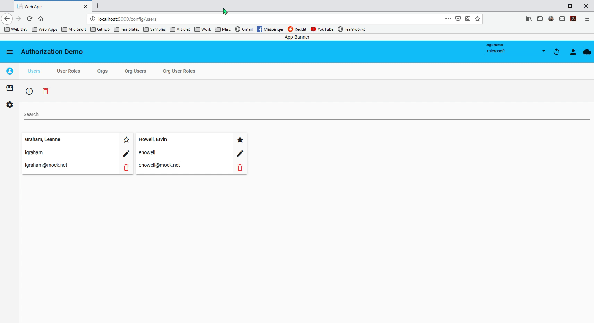

# Organization-based Role Authorization

* [Build and Run](#build-and-run)
* [Overview](#overview)
    * [Config](#config)
* [Authorization Infrastructure](#authorization-infrastructure)
    * [Entity Framework](#entity-framework)
    * [Auth Library](#auth-library)
    * [Auth Controller](#auth-controller)
      * [Checking GET Endpoints](#checking-get-endpoints)
    * [SignalR](#signalr)
* [Caveat Framework](#caveat-framework)
* [API Authorization](#api-authorization)
* [Angular Authorization](#angular-authorization)
* [Angular Layout Restriction](#angular-layout-restriction)

## Build and Run
[Back to Top](#organization-based-role-authorization)

Clone this repository:

```
git clone https://github.com/JaimeStill/OrgAuth
```

From the root `OrgAuth` folder, build the application:

```
dotnet build
```

Change directory into the **dbseeder** directory, and seed the database:

```
dotnet run -- -c "Server=(localdb)\ProjectsV13;Database=OrgAuth-dev;Trusted_Connection=True;"
```

Change directory into the **Authorization.Web** directory, and run the application:

```
dotnet run
```

The application should now be hosted at http://localhost:5000.

[](https://raw.githubusercontent.com/JaimeStill/OrgAuth/master/.resources/gifs/01-org-selector.gif)

## Overview
[Back to Top](#organization-based-role-authorization)

The intent of this repository is to demonstrate how to perform the following:
* Present an application from the viewpoint of an organization in an environment where many organizations may operate within the same application instance
* Provide role-based authorization on a per-organization basis
* Provide a means for data access to be layered based on the access a user is given within the organization

For API controllers that deal with data specific to an organization, the intent was to be able to route the org at the controller level so that access to those resources can be restricted based on permissions within that org.

In the built-in [Role-Based Authorization](https://docs.microsoft.com/en-us/aspnet/core/security/authorization/roles?view=aspnetcore-2.2) strategy for .NET Core, attributes are read before [Model Binding](https://docs.microsoft.com/en-us/aspnet/core/mvc/models/model-binding?view=aspnetcore-2.2) occurs. This means that the authorization strategy will be executed before any routed variables can be extracted from the HTTP request.

The following sections describe the infrastructure and practices established to not just enable this sort of authorization strategy, but to make the same infrastructure compatible with Angular Route authorization.

### Config
[Back to Top](#organization-based-role-authorization)

This app is intended to allow you to see how a theoretical app would be affected by different authorization conditions. Because of this, the authorization configuration is isolated from the rest of the application so that if you restrict access to the current user, you are not locked out of the authorization configuration.

The app launches at the default `/config/*` route, and has the following sub-routes:
* `/users` - Manage app `User` accounts. Users are based on an Active Directory account, or in the case of development, the mock user provider defined in `Authorization.Identity.Mock`.
* `/user-roles` - Manage user role assignments
* `/orgs` - Manage `Org` entities
* `org-users` - Manage `User` assignments to an `Org`
* `org-user-roles` - Manage `Role` assignments for a `User` in an `Org`

[](https://raw.githubusercontent.com/JaimeStill/OrgAuth/master/.resources/gifs/02-config.gif)

## Authorization Infrastructure
[Back to Top](#organization-based-role-authorization)  

This section outlines all of the infrastructure that has been written to facilitate Org-based Role Authorization. Each subsequent section deals with a particular facet of the Authorization, with each section that follows after relying on the previous infrastructure.

### Entity Framework
[Back to Top](#organization-based-role-authorization)  

The entities that enable Org-Based Role Authorization are illustrated in the following diagram:

[](https://raw.githubusercontent.com/JaimeStill/OrgAuth/master/.resources/images/org-auth-entities.png)

> Collection navigation properties that are not relevant to this diagram have been removed for brevity

> These entities are defined in [**Authorization.Data/Entities**](./Authorization.Data/Entities), and they are mapped to TypeScript interfaces in the Angular [**models/api**](./Authorization.Web/ClientApp/src/app/models/api) folder.

A `User` can be associated with many instances of `Org` and `Role`, via `OrgUser` and `UserRole` respectively. 

However, simply having a `Role` and belonging to an `Org` is not enough.

An assigned `UserRole` must then be associated with an `OrgUser` assignment, specifying the `User` has a designated `Role` within an `Org`.

### Auth Library
[Back to Top](#organization-based-role-authorization)  

> The following infrastructure is defined in the [**Authorization.Auth**](./Authorization.Auth) library

[**AuthContext.cs**](./Authorization.Auth/AuthContext.cs)

Because authorization is org-based, the current authorization context needs to be tracked to determine the current `Org` scope, the current `User`, and any `Role` association the `User` has via `OrgUserRole` associations.

[**AuthExtensions.cs**](./Authorization.Auth/AuthExtensions.cs)

When using Attribute-based authorization in <span>ASP.NET</span> Core, the policy is checked before [Model Binding]() is able to occur, so the `Org` cannot be dynamically set on a per-request basis. Because of this, action methods that should be restricted based on organization should support an `Authorize` method that wraps the method to execute if authorization completes successfully. The following are the capabilites that the **AuthExtensions.cs** class provides:

* Retrieve the `AuthContext` given the current `User` and a specified `Org`
* Retrieve the `AuthContext` given the current `User` and the `Org` specified by `User.DefaultOrg`
* Validate, given the current `User`, whether `User.IsAdmin` is `true`
* Validate, given the current `User` and an `Org`, whether any `OrgUserRole` is assigned
* Validate, given the current `User` and an `Org`, whether any `OrgUserRole` is assigned based on any of the specified `Role.Name` values
* Provide `Authorize` methods that support any of the different validation contexts

> Usage of the `Authorize` methods is demonstrated in the [**API Authorization**](#api-authorization) section below  

> In addition to the infrastructure in this library, `AuthContext` is mapped to an `AuthContext` interface in the Angular [**models**](./Authorization.Web/ClientApp/src/app/models) folder.

### Auth Controller
[Back to Top](#organization-based-role-authorization)  

[**AuthController.cs**](./Authorization.Web/Controllers/AuthController.cs)

In order to retrieve a given `AuthContext` and to provide client-side route authorization, **AuthController.cs** is created to expose all but the `Authorize` methods from **AuthExtensions.cs** above.

> The methods in this controller are exposed to Angular via a global `AuthContextService` service in the Angular [**services**](./Authorization.Web/ClientApp/src/app/services) folder

#### Checking GET Endpoints
[Back to Top](#organization-based-role-authorization)  

After seeding the database and running the app, modify the authorization context (roles, org assignments, and roles within those org assignments). When this is done, you can check the API endpoints in the browser:

* http://localhost:5000/api/org/getOrgs - This will list all of the `Org` records
* http://localhost:5000/api/user/getUsers - This will list all of the `User` records
* http://localhost:5000/api/auth/getAuthContext/1 - This will return the `AuthContext` of the current user for the `Org` with an ID of **1**.
* http://localhost:5000/api/auth/getDefaultContext - This will return the `AuthContext` of the current user based on the `Org` with an ID that matches the `User.DefaultOrgId` value.
* http://localhost:5000/api/auth/validateAdmin - Validates whether the current user's `User.IsAdmin` property is `true`.
* http://localhost:5000/api/auth/validateAnyRole/microsoft - Validates whether the current user has any role associated with the `Org` specified at the end of the route (*microsoft* in this case).

### SignalR
[Back to Top](#organization-based-role-authorization)  

When any of the authorization values associated with the current user are modified, it's imperative that the `AuthContext` is updated to reflect those changes. For instance, if an administrator removes a `User` from an `Org`, any associated `OrgUserRole` entries are removed, and they no longer have access to those `Org` resources. 

If the user affected by this change is in an active session, those changes should immediately take place transparently. Because of this, SignalR has been used to provide real-time, multicast communication between user sessions where Authorization permissions are concerned. This section will highlight not only the SignalR infrastructure, but the points where it is used to trigger these updates.

[](https://raw.githubusercontent.com/JaimeStill/OrgAuth/master/.resources/gifs/03-signalr.gif)

[**SocketHub.cs**](./Authorization.Web/Hubs/SocketHub.cs)

Defines a `triggerAuth` method that signals a `refreshAuth` function to a user with `userSocketName` if they have an open session to the application.

[**Startup.cs**](./Authorization.Web/Startup.cs)

`services.AddSignalR` is registered in `Startup.ConfigureServices` and in `Startup.Configure`, the `SocketHub` is registered to the socket route `/core-socket`.

[**socket.service.ts**](./Authorization.Web/ClientApp/src/app/services/sockets/socket.service.ts)

Manages the lifecycle of the `SocketHub` connection to `/core-socket`, provides a trigger for when `refreshAuth` is executed, and exposes the `triggerAuth` function defined in `SocketHub`.

[**layout.view.ts**](./Authorization.Web/ClientApp/src/app/views/layout.view.ts)

In `ngOnInit`, the `refreshAuth$` stream from `SocketService` is subscribed to. When it resolves with a true value, the `AuthContext` is refreshed based on the updated values. The current orgs that the user belongs to is also updated.

[**org.service.ts**](./Authorization.Web/ClientApp/src/app/services/api/org.service.ts)

When the `http.post` call in the `saveOrgUserRoles` function returns successfully, `SocketService.triggerAuth` is executed, indicating that authorizations for a user have been updated.

[**role.service.ts**](./Authorization.Web/ClientApp/src/app/services/api/role.service.ts)

When the `http.post` call in the `saveUserRoles` function returns successfully, `SocketService.triggerAuth` is executed, indicating that authorizations for a user have been updated.

[**user.service.ts**](./Authorization.Web/ClientApp/src/app/services/api/user.service.ts)

When the `http.post` call in the `toggleUserAdmin` function returns successfully, `SocketService.triggerAuth` is executed, indicating that authorizations for a user have been updated.

## Caveat Framework
[Back to Top](#organization-based-role-authorization)  

Before showing how Authorization works, it's important to understand the kind of resources that would be protected at the `Org` level. The following diagram shows how the Caveat framework is structured:

[](https://raw.githubusercontent.com/JaimeStill/OrgAuth/master/.resources/images/caveat-framework.png)

> Collection navigation properties that are not relevant to this diagram have been removed for brevity

An `Org` can have many `Item`s associated with it.

A `User` can be associated with a `Brief` via the `UserBrief` join entity.

A `Caveat` is associated with a `Brief` and can have sub-classes that link it to a specific entity. In this case, `ItemCaveat` is associated with an `Item`.

In order to retrieve a collection of `Item` records that belong to an `Org`, as well as the associated `ItemCaveat` records, a `User` must have:
* An `OrgUser` association with the `Org`
* At least one role tied to the `Org` via an `OrgUserRole`
* The `ItemCaveat` records retrieved are based on the `Brief` records a `User` is associated with given their `UserBrief` records

> The above entities are defined in the [**Authorization.Data/Entities**](./Authorization.Data/Entities) library

> The business logic for the above entities are defined in the [**Authorization.Data/Extensions**](./Authorization.Data/Extensions) library

> The API endpoints for the above entities are defined in the [**Authorization.Web/Controllers**](./Authorization.Web/Controllers) library

> The Angular models and services for the above entities are defined in the [**models/api**](./Authorization.Web/ClientApp/src/app/models/api) and [**services/api**](./Authorization.Web/ClientApp/src/app/services/api) Angular folders, respectively.

[](https://raw.githubusercontent.com/JaimeStill/OrgAuth/master/.resources/gifs/04-caveats.gif)

## API Authorization
[Back to Top](#organization-based-role-authorization)

API Authorization is purely driven by the `Authorize` methods defined in the [**AuthExtensions.cs**](./Authorization.Auth/AuthExtensions.cs) class. There are three different scenarios for `Authorize` that determine how access is permitted. Each scenario has two overloads, based on whether or not the `exec` delegate function returns a value (`Task` or `Task<T>`).

[](https://raw.githubusercontent.com/JaimeStill/OrgAuth/master/.resources/gifs/05-api-auth.gif)

> Every `Authorize` method receives a `Func<AppDbContext, Task> exec` or `Func<AppDbContext, Task<T> exec` argument, which is a delegate function for the `Task` to execute if authorization is successful.

**User is an Administrator**:
```cs
public static async Task<T> Authorize<T>(this AppDbContext db, IUserProvider provider, Func<AppDbContext, Task<T>> exec)
{
    if (await db.ValidateAdmin(provider.CurrentUser.Guid.Value))
    {
        return await exec(db);
    }
    else
    {
        throw new AppException($"{provider.CurrentUser.SamAccountName} is not an administrator", ExceptionType.Authorization);
    }
}

public static async Task Authorize(this AppDbContext db, IUserProvider provider, Func<AppDbContext, Task> exec)
{
    if (await db.ValidateAdmin(provider.CurrentUser.Guid.Value))
    {
        await exec(db);
    }
    else
    {
        throw new AppException($"{provider.CurrentUser.SamAccountName} is not an administrator", ExceptionType.Authorization);
    }
}
```

**User has any role in an Org**:
```cs
public async Task<T> Authorize<T>(this AppDbContext db, IUserProvider provider, string org, Func<AppDbContext, Task<T>> exec)
{
    if (await db.ValidateAnyRole(org, provider.CurrentUser.Guid.Value))
    {
        return await exec(db);
    }
    else
    {
        throw new AppException($"{provider.CurrentUser.SamAccountName} is not authorized to access this resource", ExceptionType.Authorization);
    }
}

public static async Task Authorize(this AppDbContext db, IUserProvider provider, string org, Func<AppDbContext, Task> exec)
{
    if (await db.ValidateAnyRole(org, provider.CurrentUser.Guid.Value))
    {
        await exec(db);
    }
    else
    {
        throw new AppException($"{provider.CurrentUser.SamAccountName} is not authorized to access this resource", ExceptionType.Authorization);
    }
}
```

**User has one of a set of roles in an Org**:

```cs
public static async Task<T> Authorize<T>(this AppDbContext db, IUserProvider provider, string org, Func<AppDbContext, Task<T>> exec, params string[] roles)
{
    if (roles.Count() < 1)
        throw new AppException("A role must be provided for Org authorization", ExceptionType.Validation);

    if (await db.ValidateRole(org, provider.CurrentUser.Guid.Value, roles))
    {
        return await exec(db);
    }
    else
    {
        throw new AppException($"{provider.CurrentUser.SamAccountName} is not authorized to access this resource", ExceptionType.Authorization);
    }
}

public static async Task Authorize(this AppDbContext db, IUserProvider provider, string org, Func<AppDbContext, Task> exec, params string[] roles)
{
    if (roles.Count() < 1)
        throw new AppException("A role must be provided for Org authorization", ExceptionType.Validation);

    if (await db.ValidateRole(org, provider.CurrentUser.Guid.Value, roles))
    {
        await exec(db);
    }
    else
    {
        throw new AppException($"{provider.CurrentUser.SamAccountName} is not authorized to access this resource", ExceptionType.Authorization);
    }
}
```

Example usage of the methods can be found in two places:

* [**ItemController.cs**](./Authorization.Web/Controllers/ItemController.cs)
* [**BriefController.cs**](./Authorization.Web/Controllers/BriefController.cs)

> You'll notice in the `ItemController` examples that an `org` argument is received, but not specified in the route definition for the method. This is because the root route signature for `ItemController` is `[Route("api/[controller]/{org}")]`.

Any method where data is retrieved in `ItemController` require that a user has any role within an `Org`:
```cs
[HttpGet("[action]")]
public async Task<List<Item>> GetItems([FromRoute]string org) =>
    await db.Authorize(provider, org, async db => await db.GetItems(org));
```

Any method where data is manipulated in `ItemController` requires that a user has the **Tech** role within an `Org`:
```cs
[HttpPost("[action]")]
public async Task AddItem([FromRoute]string org, [FromBody]Item item) =>
    await db.Authorize(provider, org, async db => await db.AddItem(item), "Tech");
```

Any method where data is manipulated in `BriefController` requires that a user is an administrator:
```cs
[HttpPost("[action]")]
public async Task AddBrief([FromBody]Brief brief) =>
    await db.Authorize(provider, async db => await db.AddBrief(brief));
```

## Angular Authorization
[Back to Top](#organization-based-role-authorization)

In Angular, [Route Guards](https://angular.io/guide/router#milestone-5-route-guards) are used to provide logic which determines whether or not a route can be accessed. The [**AuthContextService**](./Authorization.Web/ClientApp/src/app/services/auth-context.service.ts) defines all of the functions necessary for performing authorization within a route guard.

[](https://raw.githubusercontent.com/JaimeStill/OrgAuth/master/.resources/gifs/06-ng-auth.gif)

In this demo application, two guards are defined: [**AdminGuard**](./Authorization.Web/ClientApp/src/app/guards/admin.guard.ts) and [**OrgGuard**](./Authorization.Web/ClientApp/src/app/guards/org.guard.ts).

> Guards are defined in the [**guards**](./Authorization.Web/ClientApp/src/app/guards) Angular folder

**admin.guard.ts**
```ts
import { Injectable } from '@angular/core';

import {
  CanActivate,
  Router
} from '@angular/router';

import { AuthContextService } from '../services';

@Injectable()
export class AdminGuard implements CanActivate {
  constructor(
    private authContext: AuthContextService,
    private router: Router
  ) { }

  canActivate(): Promise<boolean> {
    return this.checkLogin();
  }

  checkLogin = (): Promise<boolean> =>
    new Promise(async (resolve) => {
      const res = await this.authContext.validateAdmin();
      !res && this.denyAccess(`You must be an app administrator to access this route`);
      resolve(res);
    });

  denyAccess = (message: string) => this.router.navigate(['/denied', message])
}
```

**org.guard.ts**
```ts
import { Injectable } from '@angular/core';

import {
  CanActivate,
  Router
} from '@angular/router';

import { AuthContextService } from '../services';

@Injectable()
export class OrgGuard implements CanActivate {
  constructor(
    private authContext: AuthContextService,
    private router: Router
  ) { }

  canActivate(): Promise<boolean> {
    return this.checkLogin();
  }

  checkLogin = (): Promise<boolean> =>
    new Promise(async (resolve) => {
      let context = this.authContext.readAuthContext();
      if (!context || !context.org) {
        context = await this.authContext.getDefaultContext();
      }

      const res = await this.authContext.validateAnyRole(context.org.name);
      !res && this.denyAccess(`You must have a role in ${context.org.name} to access this route`);
      resolve(res);
    });

  denyAccess = (message: string) => this.router.navigate(['/denied', message]);
}
```

In order to lock down routes using the guards, they must be passed into the `Route.canActivate` array in the route definition:

```ts
export const Routes: Route[] = [
  {
    path: 'admin',
    component: AdminComponent,
    canActivate: [AdminGuard],
    children: AdminRoutes
  },
  { path: 'config', component: ConfigComponent, children: ConfigRoutes },
  { path: 'denied', component: DeniedComponent },
  { path: 'denied/:message', component: DeniedComponent },
  { path: 'items', component: ItemsComponent, canActivate: [OrgGuard] },
  { path: '', redirectTo: 'config', pathMatch: 'full' },
  { path: '**', redirectTo: 'config', pathMatch: 'full' }
];
```

## Angular Layout Restriction
[Back to Top](#organization-based-role-authorization)

Because the `User` and `AuthContext` instances are streamed into the application interface, components can be conditionally rendered based on certain criteria.

For instance, in [**layout.view.html**](./Authorization.Web/ClientApp/src/app/views/layout.view.html), the links in the `<sidepanel>` are conditionally rendered as follows:

```html
<sidepanel>
    <panel-link link="/items"
                label="Org Items"
                icon="storefront"
                [state]="state"
                *ngIf="auth.org && auth.roles.length > 0"></panel-link>
    <panel-link link="/admin"
                label="App Settings"
                icon="settings"
                [state]="state"
                *ngIf="auth.user.isAdmin"></panel-link>
</sidepanel>
```

Another example of this is in [**items.component.html**](./Authorization.Web/ClientApp/src/app/routes/item/items.component.html), where if the current user has the **Tech** role for the current Org context, they can manipulate the collection of items in the view. This is accomplished in `ngOnInit()` of [**items.component.ts**](./Authorization.Web/ClientApp/src/app/routes/item/items.component.ts) where the `AuthContextService.auth$` stream is used to check for the presence of the **Tech** role in order to set an `authorized` variable on the component. This variable can also be passed along to child components in order to determine whether their action buttons are visible.